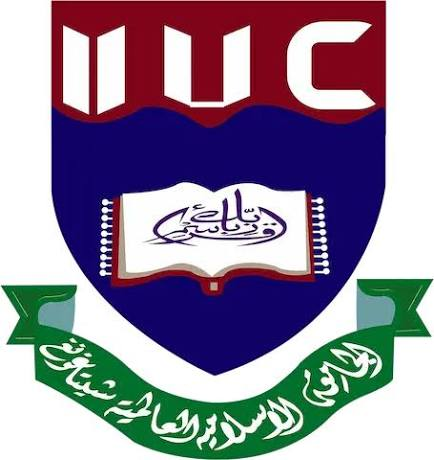

<p align="center">
  
</p>

<h1 align="center">IIUC Course Portal — Academic Management System</h1>

<p align="center">
  <b>A modern full-stack academic management system and RESTful API for International Islamic University Chittagong (IIUC)</b>
</p>

<p align="center">
  
  
  
  
  
</p>

---

## 🌟 Overview

The **IIUC Course Portal** is a production-ready, full-stack course management platform built with a high-performance **Spring Boot** backend and a responsive, modern **HTML5/CSS3/JavaScript** frontend.

It contains complete, verified semester-by-semester curriculums for **15 academic departments** across **6 faculties** of IIUC, spanning over **1,113 accredited courses** with credit hours, course typing (`Theory` vs `Lab`), prerequisites, and semester offerings.

---

## 🏛️ Academic Scope & Department Breakdown

| Faculty | Department | Total Courses | Semesters |
| :--- | :--- | :---: | :---: |
| **Faculty of Science and Engineering (FSE)** | Computer Science and Engineering (CSE) | **124** | 1st – 8th + Electives |
| | Computer & Communication Engineering (CCE) | **108** | 1st – 8th + Options I & II |
| | Electrical & Electronic Engineering (EEE) | **102** | 1st – 8th + Electives |
| | Electronic & Telecommunication Engineering (ETE) | **101** | 1st – 8th + Electives |
| | Civil Engineering (CE) | **100** | 1st – 8th + Electives |
| | Pharmacy | **83** | 1st – 8th |
| **Faculty of Arts and Humanities** | English Language and Literature (ELL) | **51** | 1st – 8th |
| | Arabic Language and Literature (ALL) | **56** | 1st – 8th |
| **Faculty of Shariah and Islamic Studies** | Qur'anic Sciences and Islamic Studies (QSIS) | **51** | 0th – 8th |
| | Da'wah and Islamic Studies (DIS) | **70** | 1st – 8th |
| | Science of Hadith and Islamic Studies (SHIS) | **5** | 1st – 5th |
| **Faculty of Business Studies** | Business Administration (BBA) | **99** | 1st – 8th + Majors |
| | Finance | **59** | 1st – 8th |
| **Faculty of Social Sciences** | Economics and Banking | **54** | 1st – 8th |
| **Faculty of Law** | Law and Land Management | **50** | 1st – 8th |
| **Total Academic Catalog** | **15 Departments Across 6 Faculties** | **1,113 Courses** | **0th – 8th** |

---

## ✨ Features

- 🔍 **Real-Time Live Search**: Instant multi-criteria search filtering across course codes, titles, departments, instructors, and prerequisites.
- 🏫 **Faculty & Department Grouping**: Multi-tier dropdown selectors organized by official IIUC faculties.
- 🏷️ **Strict Course Classification**: Color-coded badges distinguishing **Theory** (lecture) from **Lab** (sessional, workshop, practical, viva).
- 🎓 **Semester Filtering**: Seamlessly filter from **0th / Prep Semester** through **8th Semester**.
- 📊 **Dynamic Live Metrics**: Instant calculation of total courses, total credit hours, active departments, and faculty counts.
- 🗂️ **Dual Display Modes**:
  - **Card Grid View**: Interactive visual cards with badges and quick actions.
  - **Table View**: Compact, dense tabular layout with sortable data columns.
- 🌓 **Dark / Light Theme**: Built-in CSS custom property theme switcher with persistent local storage.
- ⚡ **Full CRUD Operations**: Modal dialogs for adding new courses, updating existing courses, and confirming deletions.
- 📱 **Mobile Responsive**: Fully adaptive design optimized for phones, tablets, and desktop displays.

---

## ⚡ Deploy on Vercel

Deploy this full project directly to Vercel with one click:

[](https://vercel.com/new/clone?repository-url=https%3A%2F%2Fgithub.com%2FRidwanulkarim%2FiiucRESTAPI)

### Or Deploy from Vercel Dashboard:
1. Go to [vercel.com/new](https://vercel.com/new).
2. Connect your GitHub account and import **`Ridwanulkarim/iiucRESTAPI`**.
3. Vercel automatically configures the project using [`vercel.json`](./vercel.json) (static frontend + `/api/courses` serverless REST API).
4. Click **Deploy** to go live in seconds!

---

## 🚀 Local Quick Start

### Prerequisites
- Java JDK 17 or 21+
- Maven (or use the included `./mvnw` wrapper)
- Git

### 1. Clone the Repository
```bash
git clone https://github.com/Ridwanulkarim/iiucRESTAPI.git
cd iiucRESTAPI
```

### 2. Run the Application
```bash
./mvnw spring-boot:run
```

### 3. Open in Browser
Visit **[http://localhost:8080](http://localhost:8080)** to access the portal.

---

## 📡 REST API Documentation

Base URL: `http://localhost:8080/api/courses`

| Method | Endpoint | Description | Request Body | Status Code |
| :--- | :--- | :--- | :--- | :---: |
| **GET** | `/api/courses` | Retrieve all courses | None | `200 OK` |
| **GET** | `/api/courses/{id}` | Retrieve a specific course by ID | None | `200 OK` / `404` |
| **POST** | `/api/courses` | Add a new course | Course JSON | `201 Created` |
| **PUT** | `/api/courses/{id}` | Update an existing course | Course JSON | `200 OK` / `404` |
| **DELETE** | `/api/courses/{id}` | Delete a course by ID | None | `200 OK` / `404` |

### Example Course JSON
```json
{
  "courseCode": "CSE-1121",
  "courseTitle": "Computer Programming I",
  "courseCredit": 3.0,
  "courseType": "Theory",
  "semesterOffered": "1st",
  "deptName": "Computer Science and Engineering (CSE)",
  "instructor": "Faculty Member",
  "prerequisite": ""
}
```

---

## 📁 Project Structure

```
iiucRESTAPI/
├── README.md
├── pom.xml
├── mvnw / mvnw.cmd
└── src/
    ├── main/
    │   ├── java/com/iiuc/iiucAPI/
    │   │   ├── IiucApiApplication.java       # Main Spring Boot Runner
    │   │   ├── controller/
    │   │   │   └── CourseController.java     # REST API Controller
    │   │   ├── model/
    │   │   │   └── Course.java               # Course Entity Model
    │   │   └── service/
    │   │       └── CourseService.java        # Ingested 1,113 Courses & Business Logic
    │   └── resources/
    │       ├── application.properties
    │       └── static/                       # Frontend Web Application
    │           ├── index.html                # Single-Page UI
    │           ├── css/app.css               # Modern Design System (Light/Dark)
    │           ├── js/app.js                 # REST Client & Reactive UI Logic
    │           ├── img/iiuc-logo.png         # Official IIUC University Crest
    │           └── data/courses.json         # Standalone 1,113 Course Catalog
    └── test/
        └── java/com/iiuc/iiucAPI/IiucApiApplicationTests.java
```

---

## 📜 License
Developed for International Islamic University Chittagong (IIUC).
